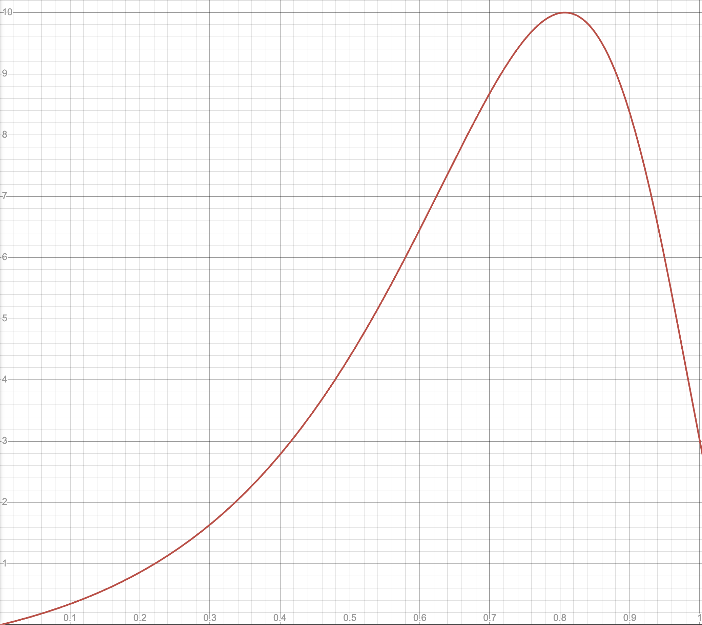

# Разработка планировщика размещения виртуальных машин на физических серверах MWS Cloud Platform

## Бизнес-контекст

MWS Cloud Platform — это облачная платформа, разработанная с нуля командой MTS Web Services.
Одним из ключевых компонентов платформы является планировщик (scheduler), который отвечает за оптимальное распределение
виртуальных машин (ВМ) по физическим серверам (хостам) в дата-центрах. Эффективный планировщик помогает минимизировать
количество включенных хостов, снижая затраты на электроэнергию, а также поддерживать баланс между утилизацией и
стабильностью работы инфраструктуры.
Это снижает вероятность отказов в размещении ВМ и обеспечивает клиентам высокую доступность услуг.

Важной частью стратегии управления ресурсами является понимание того, как влияет утилизация хостов на их надёжность и
эффективность.
Оптимальной считается загрузка на уровне 80% — это обеспечивает хорошее использование оборудования без перегрузки.
Если нагрузка превышает этот порог, вероятность выхода хостов из строя возрастает, что может привести к сбоям
в работе облака.
Выключенные хосты, в свою очередь, экономят электроэнергию.

## Описание кейса

Ваша задача — написать программу, которая получает на стандартный ввод документы в формате JSON с информацией
о ВМ и хостах, а на стандартный вывод выдаёт документы в формате JSON с предложенным распределением ВМ по хостам.

Прогон программы состоит из нескольких раундов.
На каждом раунде проверяющая система подаёт на стандартный ввод один входной документ, затем ждёт один ответный
документ.
Проверяющая система переходит к следующему раунду только после полного считывания и проверки ответного документа.

Входной документ содержит полное описание задачи, а также разницу по сравнению с предыдущим раундом
(для упрощения ручной проверки, если такая потребуется).
Ответный документ содержит полную информацию о размещении ВМ, а также отметки для проверяющей системы
об исключительных ситуациях (см. ниже).

Проверяющая система отслеживает "игровое поле" и анализирует раунды с учётом ранее принятых решений.

См. также раздел ["Ограничения и правила"](#ограничения-и-правила) ниже

### Формат входных данных

Программа принимает на стандартный ввод:

1. Список хостов с доступными ресурсами: количеством процессорных ядер и объёмом оперативной памяти в гигабайтах.
2. Список ВМ с их характеристиками (количество процессорных ядер и объёмом оперативной памяти в гигабайтах).
3. Для удобства ручной проверки (если понадобится), разница с предыдущим раундом.

Все числа — целые в интервале [0, 32767].
Все строки — не длиннее 63 символов.

Для удобства разбора стандартного ввода, все документы передаются в компактной форме без переносов строк внутри.
Входные документы для разных раундов разделены переносами строк.

Пример (реальный):
<!-- @formatter:off -->
```json
{"hosts":{"host1":{"cpu":24,"ram":512},"host2":{"cpu":32,"ram":768}},"virtual_machines":{"vm1":{"cpu":2,"ram":4},"vm2":{"cpu":3,"ram":7},"vm3":{"cpu":128,"ram":1024}},"diff":{"add":{"virtual_machines":["vm3"]}}}
```
<!-- @formatter:on -->

Тот же пример в человекочитаемой форме:
<!-- @formatter:off -->
```json
{
  "$schema": "resources/input.schema.json",
  "hosts": {
    "host1": { "cpu": 24, "ram": 512 },
    "host2": { "cpu": 32, "ram": 768 }
  },
  "virtual_machines": {
    "vm1": { "cpu": 2, "ram": 4 },
    "vm2": { "cpu": 3, "ram": 7 },
    "vm3": { "cpu": 128, "ram": 1024 }
  },
  "diff":{
    "add": { "virtual_machines": [ "vm3" ] }
  }
}
```
<!-- @formatter:on -->

Пример полных входных данных для целого прогона в файле
[example_input_multiple_rounds.txt](resources/example_input_multiple_rounds.txt)

### Формат выходных данных

Программа должна выдавать на стандартный вывод:

1. Полную "карту" размещения ВМ по хостам.
2. Отметку о невозможности размещения ВМ, если такая ситуация произошла.
3. Отметки о миграции (перемещении) ВМ с хоста на хост, если алгоритм считает это нужным.

Проверяющая система ожидает корректный документ в формате JSON и будет вычитывать данные из потока, пока не получит
полный документ. Требований по разделителям нет, но добавить переносы строки между документами не возбраняется.

Пример:
<!-- @formatter:off -->
```json
{
  "$schema": "resources/output.schema.json",
  "allocations": {
    "host1": [ "vm1" ],
    "host2": [ "vm2" ]
  },
  "allocation_failures": [ "vm3" ],
  "migrations": {
    "vm2": { "from": "host1", "to": "host2" }
  }
}
```
<!-- @formatter:on -->

### Ограничения и правила

1. Хосты появляются на первом раунде, после чего набор хостов и значения их характеристик не меняются.
2. Суммарное использование ресурсов размещёнными ВМ не превышает значений,
   указанных в характеристиках хоста.
3. По сравнению с предыдущим раундом, во входном документе:
    * либо одна ВМ добавляется,
    * либо одна ВМ удаляется.
4. Не допускается изменять набор ВМ на отдельно взятом хосте, кроме следующих случаев:
    1. Удаление ВМ, которые не пришли в текущем раунде.
    2. Добавление новых ВМ, если возможно (иначе следует проставить отметку о невозможности размещения).
    3. Миграция ВМ между хостами с обязательной фиксацией отметок о перемещении ВМ.
5. Отказы в размещении возможны только для новых ВМ.
6. Обязательно проставляются отметки об исключительных ситуациях:
    * невозможность размещения ВМ;
    * миграция ВМ между хостами.

### Начисление баллов

Баллы подсчитываются как вещественные числа.
В расчётах используется представление `binary64` по IEEE754 (т.н. двойная точность),
финальный результат округляется до четырёх знаков после запятой.

Под утилизацией ресурса понимается отношение суммарного использования ресурса размещёнными ВМ
к полному количеству ресурса.
Под утилизацией хоста понимается наибольшее значение утилизации среди всех видов ресурсов
(в этом кейсе их два: количество процессорных ядер и объём оперативной памяти в гигабайтах).

Каждый раунд начисляются баллы за каждый хост по следующему принципу:

- *Утилизация 100%* → ~3 балла _(неоптимальный режим — предельная нагрузка)_
- *Утилизация ~80%* → 10 баллов _(оптимальный режим)_
- *Утилизация <80%* → <10 баллов _(неоптимальный режим — недозагрузка)_
- *Утилизация 0%* → 0 баллов, но см. также важное примечание ниже.

Для вычисления вознаграждения за утилизацию используется следующая формула:
$$f(x) =-0.67459 + {{42.38075}\over{-2.5x+5.96}}\cdot\exp(-2\cdot(\ln(-2.5x+2.96))^2)$$



С точностью до шестого знака: $f(0) = 0$, $f(0.807197) = 10$, $f(1) = 2.992622$

Если хост имел нулевую утилизацию в течение 5 и более раундов подряд И на хосте ранее уже размещались ВМ —
за каждый такой раунд начисляется дополнительно по 8 баллов.  
(Хост не используется, следовательно, его можно выключить — экономия).

### Штрафы

- *Невозможность разместить ВМ* → $—5\cdot h$ баллов, где $h$ — число хостов.
- *Миграция ВМ между хостами* → $m^2$ баллов, где $m$ — число ВМ, перемещённых за раунд.

### Оформление решений и процедура оценки

Решения принимаются в одном из следующих вариантов:

### 1. Рекомендуемый вариант: Docker-образ

- **Требования**:
    - Образ контейнера для Docker 26.x.
    - Поддерживаемые платформы:
        - `linux/arm64/v8` (aarch64, ARM64)
        - `linux/amd64` (x86-64, AMD64/Intel 64)

### 2. Альтернативный вариант: архив с приложением

Если есть сложности в сборке Docker-образа, решение может быть предоставлено в виде архива:

- **Форматы архива**: `.zip` или `.tar.gz`.
- **Требования**:
    - Собранное приложение должно поддерживать Linux под одну из архитектур:
        - `arm64/aarch64`
        - `amd64/x86_64`
    - **Структура архива**:
        - В корне архива должен находиться исполняемый файл или скрипт с именем `run`, который запускает программу.
        - В корне архива может быть файл `README` с дополнительной информацией для проверяющих.
        - Архив должен содержать все зависимости (библиотеки и среду выполнения), за исключением:
            - OpenJDK 8, 11, 17, 21
            - Python 3.9—3.13

**Примечание**: Проверяющие постараются собрать Docker-образ из архива, но результат не гарантируется.

Автоматическая проверяющая система будет запускать программы в контейнерах Docker таким образом:

```
docker run --cpus <CPUS> --init --interactive --memory 2GB --network none --no-healthcheck --read-only \
    --tmpfs /tmp:rw,noexec,nosuid --ulimit cpu=<SEC> <IMAGE>
```

где

- `<CPUS>` — 3 для ARM64, 6 для AMD64 (3 ядра по 2 аппаратных потока)
- `<SEC>` — ограничение процессорного времени на весь прогон, вычисляется как $k\cdot s$,
  где $k$ — количество раундов в прогоне, $s$ — 1 секунда для ARM64 и 2 секунды для AMD64
- `<IMAGE>` — идентификатор образа

Версия ядра Linux: 6.6 или выше.

Процессоры: Apple M1 Pro для ARM64 и AMD Ryzen 5 3500U для AMD64.
